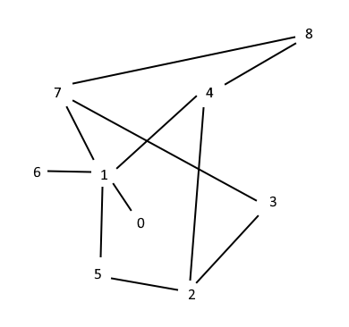

# Activity 10: Graph Searching

## 1. My graph diagram


## 2. Implementation of BFS and DFS

```cpp
#include <iostream>
#include <vector>
#include <queue>
#include <set>
#include <stack>

using namespace std;


int main() {

    vector<vector<int>> graph;
    graph.resize(9); 

    graph[0] = {1};
    graph[1] = {0, 4, 5, 6, 7};
    graph[2] = {3, 4, 5};
    graph[3] = {2, 7};
    graph[4] = {1, 2, 8};
    graph[5] = {1, 2};
    graph[6] = {1};
    graph[7] = {1, 3, 8};
    graph[8] = {4, 7};


    // Breadth-First Search (BFS) ------------------------------
    queue<int> frontier;
    frontier.push(0);

    
    set<int> visited;
    visited.insert(0);
    cout << "BFS: ";
    cout << 0 << " ";

    while (!frontier.empty()) {
        int currentV = frontier.front();
        frontier.pop();

        for (int i = 0; i < graph[currentV].size(); i++) {
            int adjV = graph[currentV][i];

            if (!visited.count(adjV)) {
                frontier.push(adjV);
                visited.insert(adjV);
                cout << adjV << " ";
            }
        }
    }

    // Result: 0 1 4 5 6 7 2 8 3
    cout << endl;
    visited.clear();


    // Depth-First Search (DFS) ------------------------------
    stack<int> s;
    s.push(0);

    cout << "DFS: ";

    while (!s.empty()) {
        int currentV = s.top();
        s.pop();


        if (!visited.count(currentV)) {
            visited.insert(currentV);
            cout << currentV << " ";

            for (int i = 0; i < graph[currentV].size(); i++) {
                int adjV = graph[currentV][i];
                s.push(adjV);
                
                
            }
        }
    }
    
    // Result: 0 1 7 8 4 2 5 3 6
    cout << endl;
}
```

## 3. Comparing BFS and DFS in the context of Big O Notation

#### Time Complexity
Both algorithms visit each vertex and each edge only once. Therefore, they have the same time complexity of $O(V + E)$

#### Space Complexity
This is where the two algorithms greately differ. Their usage of runtime memory is very different from each other.

**Breadth-First algorithm** has to store the entire level of the graph at once. This means that if a vertex has 1,000 neighbors, then memory has to store all 1,000 neighbors at once. It will be inefficient to use on very wide trees (shallow but many edges)

**Depth-First algorithm** only stores the height, a branch its traversing over, when traversing. Even if vertices have no more than a few edges, if the height is very high, it will have to keep track of the entire height in memory. It will be very inefficient on very deep graphs, but it will work well for graphs that have vertices with many edges.