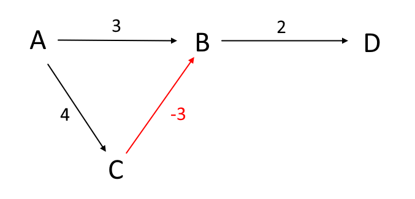

# Activity 11: Explain with the help of an example "Why Dijkstra's algorithm fails on negative weights".

Dijkstra's algorithm fails on negativee weights because it operates on the assumption that once a vertex is marked "visited," its shortest path from the start vertex is found and will never change. However, negative weights break this assumption because they allow a path to a vertex get cheaper as it gets longer. The algorithm does not account for that.

Consider the following graph where path from C to B is negative

1. Algorithm goes to A's neighbors, B and C.
2. B gets a new distance of 3
3. C gets a new distance of 4
4. A is marked visited
5. Algorithm begins with B since it has lowest distance so far
6. D gets a new distance of (3 + 2) = 5
7. B is marked as visited
8. Algorithm then goes to C
9. B gets an updated distance of (4 - 3) = 1
Problem: Even though B now has a new distance of 1 (smaller than 3), the algorithm won't visit B again to update a new path to D since B is already marked as visited. As a result, algorithm will eventually incorrectly conclude that the shortest path to D is A -> B -> D, even though A -> C -> B -> D is actually shorter.